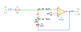

# augmenting_integrator

SBOA092B pages 59 and 60, *Augmenting Integrator*: E_I through R_I (10 kΩ) into
the summing point, with R_O (100 kΩ) in series with C_O (10 µF) as the
feedback. "Sums the input signal and its time integral."

```
E_O = -(R_O/R_I) E_I - 1/(C_O R_I) ∫ E_I dt
```

## The circuit



The schematic is drawn by [copperhead](https://github.com/copperheadhq/copperhead)'s
drafting engine from this circuit's netlist, with KiCad's own library symbols,
and it opens in KiCad as [`figure/augmenting_integrator.kicad_sch`](figure/augmenting_integrator.kicad_sch).
The op amp is KiCad's generic one, since the handbook's are ideal, and each
terminal is a test point named as the program names it. KiCad reads back from
the sheet exactly the connections the circuit has; `draw.py` refuses to write
one that does not.


The interconnect view is fang's own projection. It names the parts as the
program does, so it reads against the code below.

## What the program says

Two parameters, `gain = -10` (-R_O/R_I) and `rate = -10 /s`
(-1/(C_O R_I)), each held to the parts. The bench uses a 0.1 V step at
10 ms, starting from rest (`bench`). The proportional term shows up as a
jump and the integral as the ramp after it, so one waveform carries both.

## What the simulation found

[`out/simulation.txt`](out/simulation.txt), from the deck under [`out/spice/`](out/spice/):

| Run | Measured | Claimed |
| --- | ---: | ---: |
| `step`, the jump (ramp extrapolated back to the step) over E_I | -10 | -10 (`gain`), holds |
| `step`, the slope after it over E_I | -10 /s | -10 /s (`rate`), holds |

The output is -1.1 V at 0.11 s and -2.0 V at 1.01 s: a jump to -1 V, then a
fall of 1 V/s.

## Where the handbook is off

The handbook evaluates the formula as "-10 E_I - ∫ E_I dt". The first term is
right. The second is not: C_O R_I is 10 µF × 10 kΩ = 0.1 s, so the integral
has a coefficient of 10, not 1. To get 1 it would need C_O = 100 µF. The
program claims the rate the parts give, and the simulation measures that rate.

## Running it

```bash
fang check examples/ti_opamp_handbook/integrators/augmenting_integrator/augmenting_integrator.py
python examples/regenerate.py ti_opamp_handbook/integrators/augmenting_integrator   # needs ngspice
```
