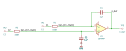

# differential_integrator

SBOA092B page 59, *Differential Integrator*: E1 through R_I (100 kΩ) to the
- input with C_O (1 µF) to the output, and E2 through a second R_I to the
+ input with a second C_O to ground. The figure names a TLC265x.

```
E_O = -1/(R_I C_O) ∫ (E1 - E2) dt = 10 ∫ (E2 - E1) dt
```

## The circuit



The schematic is drawn by [copperhead](https://github.com/copperheadhq/copperhead)'s
drafting engine from this circuit's netlist, with KiCad's own library symbols,
and it opens in KiCad as [`figure/differential_integrator.kicad_sch`](figure/differential_integrator.kicad_sch).
The op amp is KiCad's generic one, since the handbook's are ideal, and each
terminal is a test point named as the program names it. KiCad reads back from
the sheet exactly the connections the circuit has; `draw_figures.py` refuses to write
one that does not.


The interconnect view is fang's own projection. It names the parts as the
program does, so it reads against the code below.

## What the program says

One parameter, `rate = 10 /s`. Two constraints tie it to each side's R_I C_O,
so the two sides have to match. The E2 side is an RC low-pass whose capacitor
integrates E2. The E1 side integrates about that voltage, so the output
integrates the difference. The figure draws no reset, so every run starts all
three capacitor nodes at zero with `.ic` (`start`).

## What the simulation found

[`out/simulation.txt`](out/simulation.txt), from the decks under [`out/spice/`](out/spice/):

| Run | Measured | Claimed |
| --- | ---: | ---: |
| `difference`, E1 = 0.1 V, E2 = 0.3 V, slope over (E2 - E1) | 10 /s | 10 /s (`rate`), holds |
| `common_mode`, E1 = E2 = 0.5 V, output at 1 s | 0 V | 0 V ± 1 mV, holds |

## Where the handbook is off

The first line of the printed formula has "(E_I - E_2)", where E_I should be
E_1. The second line gives the sign the circuit has, and that is the line the
program claims.

## Running it

```bash
fang check examples/ti_opamp_handbook/integrators/differential_integrator/differential_integrator.py
python examples/regenerate.py ti_opamp_handbook/integrators/differential_integrator   # needs ngspice
```
