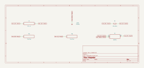

# integrator

SBOA092B page 55, *Integrators*: the inverting amplifier with a capacitor in
place of its feedback resistor. E_I through R_I into the summing point, C_O
from the output back to it.

```
E_O = -Z_O/Z_I E_I = -E_I/(R_I C_O p) = -1/(R_I C_O) ∫ E_I dt
```

## The circuit



The schematic is compiled from the program and drawn by KiCad, and it opens in
KiCad as [`out/integrator.kicad_sch`](out/integrator.kicad_sch). A part with a symbol
of its own is drawn with it; the op amp and the handbook's other parts are
boxes carrying their own pins, and each net is a label rather than a wire.


The interconnect view is fang's own projection. It names the parts as the
program does, so it reads against the code below.

## What the program says

The figure names R_I and C_O and gives no values. The program chooses 10 kΩ
and 0.1 µF (`values`): R_I C_O = 1 ms, a rate of -1000 V/s per volt, and a
gain of 1 at 159 Hz. Two parameters carry the claims, `rate = -1000 /s` and
`f_unity = 159.15 Hz`, each held to the parts by a constraint.

The figure has no reset, so the transient run starts the output at zero with
an initial condition (`start`). Without one, an integrator starts wherever the
solver puts it.

## What the simulation found

[`out/simulation.txt`](out/simulation.txt), from the decks under [`out/spice/`](out/spice/):

| Run | Measured | Claimed |
| --- | ---: | ---: |
| `ramp`, 10 mV DC step, slope over E_I | -1000 /s | -1000 /s (`rate`), holds |
| `sine`, gain at 159.155 Hz | 1 | 1, holds |
| `sine`, gain at 15.9155 Hz | 10 | 10, holds |
| `sine`, phase at 159 Hz | 90° | 90°, holds |

The gain is 1/(2π f R_I C_O): it falls a decade per decade of frequency. The
phase is +90°, not -90°. The integral lags the input by 90° and the inversion
adds 180°, so the output leads the input by 90°.

## Running it

```bash
fang check examples/ti_opamp_handbook/integrators/integrator/integrator.py
python examples/regenerate.py ti_opamp_handbook/integrators/integrator   # needs ngspice and kicad-cli
```
