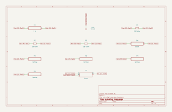

# summing_integrator

SBOA092B page 58, *Summing Integrator*: E1, E2 and E3 each through 100 kΩ into
one summing point, C_O (1 µF) across the op amp, and a reset switch across
C_O.

```
E_O = -1/(RC) ∫ (E1 + E2 + E3) dt = -10 ∫ (E1 + E2 + E3) dt
```

## The circuit



The schematic is compiled from the program and drawn by KiCad, and it opens in
KiCad as [`out/summing_integrator.kicad_sch`](out/summing_integrator.kicad_sch). A part with a symbol
of its own is drawn with it; the op amp and the handbook's other parts are
boxes carrying their own pins, and each net is a label rather than a wire.


The interconnect view is fang's own projection. It names the parts as the
program does, so it reads against the code below.

## What the program says

One parameter, `rate = -10 /s`. There are three constraints, one for each
input resistor, and each says its own -1/(R C_O) is that same rate. The
figure gives no drive, so the program chooses two (`bench`). The first puts
0.1, 0.2 and 0.3 V on the inputs. The second uses 0.5, -0.2 and 0.1 V, so
one input has the opposite sign. The reset switch opens at 10 ms in both.

## What the simulation found

[`out/simulation.txt`](out/simulation.txt), from the decks under [`out/spice/`](out/spice/):

| Run | Sum | Output slope | Slope over sum | Claimed |
| --- | ---: | ---: | ---: | ---: |
| `sum` | 0.6 V | -6 V/s | -10 /s | -10 /s (`rate`), holds |
| `mixed_signs` | 0.4 V | -4 V/s | -10 /s | -10 /s (`rate`), holds |

The output follows the algebraic sum of the inputs, whatever their signs.

## Running it

```bash
fang check examples/ti_opamp_handbook/integrators/summing_integrator/summing_integrator.py
python examples/regenerate.py ti_opamp_handbook/integrators/summing_integrator   # needs ngspice and kicad-cli
```
