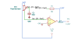

# adjustable_lag

SBOA092B page 84, *Adjustable Lag*: a 10 kΩ pot from E_I to the summing point
with its wiper through C = 10 µF to ground, and R_O = 10 kΩ across.

```
E_O = -E_I / (1 + (D - D²) R C P) = -40 E_I / (40 + P)
```

## The circuit



The schematic is drawn by [copperhead](https://github.com/copperheadhq/copperhead)'s
drafting engine from this circuit's netlist, with KiCad's own library symbols,
and it opens in KiCad as [`figure/adjustable_lag.kicad_sch`](figure/adjustable_lag.kicad_sch).
The op amp is KiCad's generic one, since the handbook's are ideal, and each
terminal is a test point named as the program names it. KiCad reads back from
the sheet exactly the connections the circuit has; `draw.py` refuses to write
one that does not.


The interconnect view is fang's own projection. It names the parts as the
program does, so it reads against the code below.

## What the program says

At DC the capacitor is open and the whole pot is in series with E_I, so the
gain is `a_v = -R_O / R = -1` at any setting. The capacitor sees
(D - D²) R, which is largest at D = 1/2: R C / 4 = 25 ms, the page's
-40/(40 + P). The program holds its claims at D = 1/2 (`setting`) and adds a
second setting, `d_other = 0.1`, with its corner `f_other`. The printed formula
checks out.

## What the simulation found

[`out/simulation.txt`](out/simulation.txt):

| Run | Measured | Claimed |
| --- | ---: | ---: |
| `dc_gain`, D = 1/2 | -1 | -1 (`a_v`), holds |
| `dc_gain_other`, D = 0.1 | -1 | -1 (`a_v`), holds |
| `lag_centered`, -3 dB point | 6.366 Hz | 6.366 Hz (`f_c`), holds |
| `lag_centered`, phase at the corner | 2.356 rad (135°) | 135°, holds |
| `lag_other`, -3 dB point | 17.68 Hz | 17.68 Hz (`f_other`), holds |
| `lag_other`, phase at the corner | 2.356 rad (135°) | 135°, holds |

The wiper moves the corner and leaves the DC gain alone, as the page says.

## Running it

```bash
fang check examples/ti_opamp_handbook/lead_lag/adjustable_lag/adjustable_lag.py
python examples/regenerate.py ti_opamp_handbook/lead_lag/adjustable_lag   # needs ngspice
```
