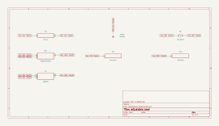
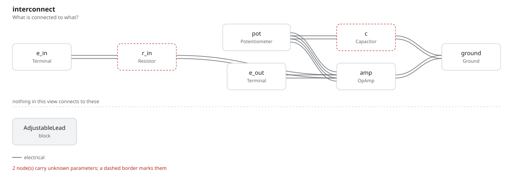

# adjustable_lead

SBOA092B page 85, *Adjustable Lead*: R = 10 kΩ in, and a 10 kΩ pot from the
summing point to the output with its wiper through C = 10 µF to ground. It is
the adjustable lag's input network moved into the feedback path.

```
E_O = -[(D - D²) R C P] E_I          (as printed)
```

## The circuit



The schematic is compiled from the program and drawn by KiCad, and it opens in
KiCad as [`out/adjustable_lead.kicad_sch`](out/adjustable_lead.kicad_sch). A part with a symbol
of its own is drawn with it; the op amp and the handbook's other parts are
boxes carrying their own pins, and each net is a label rather than a wire.



The interconnect view is fang's own projection. It names the parts as the
program does, so it reads against the code below.

## What the program says

The feedback is a T whose transfer impedance is R [1 + (D - D²) R C P], so the
drawn circuit is

```
E_O = -[1 + (D - D²) R C P] E_I
```

a DC gain of `a_v = -1` with a zero at 1/((D - D²) R C). The claims are held
at D = 1/2 (`setting`), where the zero is lowest: 40 rad/s, `f_z` = 6.37 Hz.

## Where the handbook is off

The printed form drops the 1. Without it the stage would be a pure
differentiator with no gain at DC; the drawn circuit passes DC at -1 and the
bench measures it. At the zero the gain is |1 + j| = 1.414, where the printed
form would give 1.

## What the simulation found

[`out/simulation.txt`](out/simulation.txt):

| Run | Measured | Claimed |
| --- | ---: | ---: |
| `dc_gain` | -1 | -1 (`a_v`), holds |
| `lead`, +3 dB point | 6.366 Hz | 6.366 Hz (`f_z`), holds |
| `lead`, gain at the zero | 1.414 | 1.414, holds |
| `lead`, phase at the zero | -2.356 rad (-135°) | -135°, holds |
| `lead`, gain a decade above | 10.05 | 10.05, holds |

## Running it

```bash
fang check examples/ti_opamp_handbook/lead_lag/adjustable_lead/adjustable_lead.py
python examples/regenerate.py ti_opamp_handbook/lead_lag/adjustable_lead   # needs ngspice and kicad-cli
```
