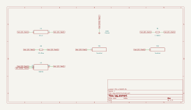

# lag_element

SBOA092B page 84, *Lag Element*: an inverting amplifier with C_O across R_O.
The figure draws R_I = 1 MΩ, R_O = 10 kΩ and C_O = 10 µF.

```
E_O = -(R_O / R_I) E_I / (1 + R_O C_O P) = -10 E_I / (10 + P)
```

## The circuit



The schematic is compiled from the program and drawn by KiCad, and it opens in
KiCad as [`out/lag_element.kicad_sch`](out/lag_element.kicad_sch). A part with a symbol
of its own is drawn with it; the op amp and the handbook's other parts are
boxes carrying their own pins, and each net is a label rather than a wire.


The interconnect view is fang's own projection. It names the parts as the
program does, so it reads against the code below.

## What the program says

The claims are two parameters held to the parts: the DC gain
`a_v = -R_O / R_I = -0.01`, and the corner `f_c = 1/(2π R_O C_O) = 1.59 Hz`
(10 rad/s). The program keeps the drawn values and records that as a decision
(`reading`).

## Where the handbook is off

The printed right-hand side, -10/(10 + P), has a DC gain of -1. The drawn
values give -0.01/(1 + 0.1 P) = -0.1/(10 + P). The pole agrees (R_O C_O =
0.1 s); the gain is off by a factor of 100. R_I = 10 kΩ would make the printed
form true. Swapping R_I and R_O does not: that gives -100/(1 + 10 P).

## What the simulation found

[`out/simulation.txt`](out/simulation.txt), from the decks under
[`out/spice/`](out/spice/):

| Run | Measured | Claimed |
| --- | ---: | ---: |
| `dc_gain`, operating point, E_I = 1 V | -0.01 | -0.01 (`a_v`), holds |
| `corner`, gain at 10 mHz | 0.01 | 0.01, holds |
| `corner`, -3 dB point | 1.592 Hz | 1.592 Hz (`f_c`), holds |

## Running it

```bash
fang check examples/ti_opamp_handbook/lead_lag/lag_element/lag_element.py
python examples/regenerate.py ti_opamp_handbook/lead_lag/lag_element   # needs ngspice and kicad-cli
```
