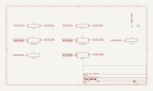

# lead_lag

SBOA092B page 86, *Lead-Lag*: the adjustable lag's input network and the
adjustable lead's feedback network around one op amp. Two 10 kΩ pots, each
with its wiper through 10 µF to ground: D2 and C2 at the input, D1 and C1 in
the feedback.

```
E_O = (1 + (D1 - D1²) R C1 P) / (1 + (D2 - D2²) R C2 P)          (as printed)
```

## The circuit



The schematic is compiled from the program and drawn by KiCad, and it opens in
KiCad as [`out/lead_lag.kicad_sch`](out/lead_lag.kicad_sch). A part with a symbol
of its own is drawn with it; the op amp and the handbook's other parts are
boxes carrying their own pins, and each net is a label rather than a wire.


The interconnect view is fang's own projection. It names the parts as the
program does, so it reads against the code below.

## What the program says

The input network passes E_I / (R (1 + (D2 - D2²) R C2 P)) into the summing
point and the feedback T turns it into -R (1 + (D1 - D1²) R C1 P) times that,
so the drawn circuit is

```
E_O = -(1 + (D1 - D1²) R C1 P) / (1 + (D2 - D2²) R C2 P) E_I
```

The page gives no settings. The program holds its claims at D1 = 1/2 and
D2 = 0.1 (`settings`): a zero at 6.37 Hz (`f_zero`), a pole at 17.7 Hz
(`f_pole`), a DC gain of `a_v = -1` and a high-frequency gain of
`a_hf = 2.78`, the ratio of the two time constants.

## Where the handbook is off

The printed form has no minus sign (and leaves E_I off). The stage inverts:
the bench measures -1 at DC.

## What the simulation found

[`out/simulation.txt`](out/simulation.txt):

| Run | Measured | Claimed |
| --- | ---: | ---: |
| `dc_gain` | -1 | -1 (`a_v`), holds |
| `response`, gain at 100 mHz | 1 | 1, holds |
| `response`, gain at 100 Hz | 2.742 | 2.741, holds |
| `response`, phase at 10.6 Hz | -2.652 rad | -2.652 rad, holds |

The phase is -180° plus the peak lead of 28.1°, at the geometric mean of the
zero and the pole. The spot frequencies stay low on purpose: above a few
hundred hertz the wiper capacitor shorts most of the feedback, the loop gain
runs out, and the op amp rather than the network sets the gain, so `a_hf` is
held by the check and approached, not measured.

## Running it

```bash
fang check examples/ti_opamp_handbook/lead_lag/lead_lag/lead_lag.py
python examples/regenerate.py ti_opamp_handbook/lead_lag/lead_lag   # needs ngspice and kicad-cli
```
