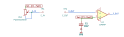
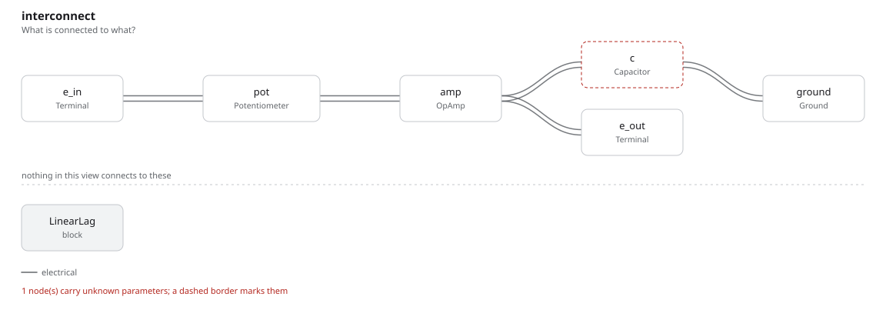

# linear_lag

SBOA092B page 85, *Lag value linear with R setting*: a voltage follower whose
+ input sits on an RC low-pass, E_I through a 10 kΩ pot wired as a rheostat
and C = 10 µF to ground.

```
E_O = E_I / (1 + D R C P) = 10 E_I / (10 + P)
```

## The circuit



The schematic is drawn by [copperhead](https://github.com/copperheadhq/copperhead)'s
drafting engine from this circuit's netlist, with KiCad's own library symbols,
and it opens in KiCad as [`figure/linear_lag.kicad_sch`](figure/linear_lag.kicad_sch).
The op amp is KiCad's generic one, since the handbook's are ideal, and each
terminal is a test point named as the program names it. KiCad reads back from
the sheet exactly the connections the circuit has; `draw_figures.py` refuses to write
one that does not.



The interconnect view is fang's own projection. It names the parts as the
program does, so it reads against the code below.

## What the program says

The wiper is tied to the end at E_I, so the path is D R and the time constant
D R C, linear in the setting. The program counts D from the + input end
(`rheostat`), so full travel is all 10 kΩ, the page's 10/(10 + P). The claims
are the unity DC gain `a_v` and the corners at D = 1, 1/2 and 1/4 (`f_c`,
`f_half`, `f_quarter`). The printed formula checks out.

## What the simulation found

[`out/simulation.txt`](out/simulation.txt):

| Run | Measured | Claimed |
| --- | ---: | ---: |
| `dc_gain` | 1 | 1 (`a_v`), holds |
| `full_travel`, D = 1, -3 dB point | 1.592 Hz | 1.592 Hz (`f_c`), holds |
| `half_travel`, D = 1/2 | 3.183 Hz | 3.183 Hz (`f_half`), holds |
| `quarter_travel`, D = 1/4 | 6.366 Hz | 6.366 Hz (`f_quarter`), holds |

## Running it

```bash
fang check examples/ti_opamp_handbook/lead_lag/linear_lag/linear_lag.py
python examples/regenerate.py ti_opamp_handbook/lead_lag/linear_lag   # needs ngspice
```
