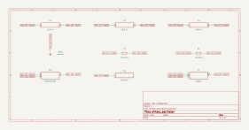

# simple_oscillator

SBOA092B page 83, *Simple Oscillator*: two T networks in parallel from the
output back to the - input, R, R with 2C to ground between them, and C, C
with R/2 to ground between them. The op amp runs open loop through them.

```
f = 1 / (2 pi R C)
```

## The circuit



The schematic is compiled from the program and drawn by KiCad, and it opens in
KiCad as [`out/simple_oscillator.kicad_sch`](out/simple_oscillator.kicad_sch). A part with a symbol
of its own is drawn with it; the op amp and the handbook's other parts are
boxes carrying their own pins, and each net is a label rather than a wire.


The interconnect view is fang's own projection. It names the parts as the
program does, so it reads against the code below.

## What the program says

The two T's are a twin-T notch. At d.c. the R-R path feeds the output back to
the - input, negative feedback, and the circuit is still. At 1 / (2 pi R C)
a balanced twin-T passes nothing; trim R/2 a little low and what it passes
there turns negative, so the inverting op amp gets its own output back in
phase and oscillates. Two decisions are recorded:

- `values`: R = 10 kΩ and C = 15.9 nF (2C = 31.8 nF), for 1.001 kHz.
- `trim`: R/2 is a 10 kΩ rheostat (so mid-travel is R/2) set to 0.49, 2% low.

The constraints tie f_o to R and C, the two R's and two C's to each other,
2C to twice C, and the trim to the low side of R/2.

## What the simulation found

[`out/simulation.txt`](out/simulation.txt), 200 ms from a 1 V kick on the 2C
capacitor, measured over the last 50 ms:

| Measured | Value | Claimed |
| --- | ---: | ---: |
| frequency, 40 cycles | 1.006 kHz | 1 kHz (`f_o`) ±1%, holds |
| output high | 13.51 V | 13.5 V ±1%, holds |
| output low | -13.51 V | -13.5 V ±1%, holds |
| peak at the - input | 223 mV | not a claim |

Nothing in the loop limits the amplitude, so the output grows until it clips
at the op amp's swing and is close to a square wave; the - input, filtered by
the network, carries a far cleaner wave of about 0.2 V. Trimming R/2 2% low
moves the frequency up 0.5%. Nearer balance the frequency moves less but the
oscillation takes much longer to build.

## Running it

```bash
fang check examples/ti_opamp_handbook/oscillators/simple_oscillator/simple_oscillator.py
python examples/regenerate.py ti_opamp_handbook/oscillators/simple_oscillator   # needs ngspice and kicad-cli
```
