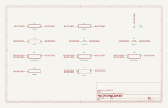

# wien_bridge_oscillator

SBOA092B page 83, *Wien Bridge Oscillator*: R and C in series from the output
to the + input, R and C in parallel from there to ground; R2 (1.8 kΩ) and the
R1 rheostat (500 Ω) from the output to the - input, R3 (220 Ω) and a GE 1869
lamp from there to ground.

```
f_O = 1 / (2 pi R C), 100 to 6000 Hz
```

## The circuit



The schematic is compiled from the program and drawn by KiCad, and it opens in
KiCad as [`out/wien_bridge_oscillator.kicad_sch`](out/wien_bridge_oscillator.kicad_sch). A part with a symbol
of its own is drawn with it; the op amp and the handbook's other parts are
boxes carrying their own pins, and each net is a label rather than a wire.


The interconnect view is fang's own projection. It names the parts as the
program does, so it reads against the code below.

## What the program says

The Wien network passes a third of the output in phase at 1 / (2 pi R C), so
the op amp oscillates there at a gain of 3, which needs R3 + R_lamp =
(R1 + R2) / 2. A cold lamp is a small resistance, so the gain starts high and
the oscillation grows until the lamp warms to that point.

The program defines a `Lamp` part: the resistance is linear in the power the
filament has taken, filtered with a 50 ms thermal time constant, from 70 Ω
cold to 714 Ω at the 1869's 10 V, 14 mA rating (`lamp_model`). R and C are two
ganged 100 kΩ rheostats and two 15.9 nF capacitors, which covers the page's
100 Hz to 6000 Hz (`tuning`). R1 is set to 50 Ω, so the lamp must settle at
705 Ω (`gain_trim`), and a constraint checks that is no more than the lamp's
714 Ω at rating.

## What the simulation found

[`out/simulation.txt`](out/simulation.txt):

| Run | Frequency | Output peak | Lamp | Claimed |
| --- | ---: | ---: | ---: | --- |
| `as_drawn`, ±13.5 V swing, 1 kHz setting | 635 Hz | clipped at ±13.5 V | 84 Ω | clipping, holds |
| `regulating_1khz`, ±60 V swing | 1.001 kHz | 54.95 V, settled | 705 Ω | f ±0.5%, settled, lamp ±1%: hold |
| `regulating_6khz`, ±60 V swing | 5.987 kHz | 54.95 V, settled | 705 Ω | 6.006 kHz ±0.5%, settled, lamp ±1%: hold |

With room to swing, the lamp does what the page intends: the amplitude
settles, the lamp sits at the gain-3 point, and the frequency is
1 / (2 pi R C) within 0.3% at both ends of the range.

## Where the handbook is off

The drawn values need the lamp at (R1 + R2) / 2 - R3, 680 Ω to 930 Ω across
R1's travel. A GE 1869 is 714 Ω only at its 10 V, 14 mA rating, so the lamp
has to run near rating, and the output then carries 3 × 14 mA × 925 Ω, about
39 V rms. On the ±15 V supplies the handbook assumes elsewhere, the output
clips first: the lamp warms only to about 84 Ω, the gain stays far above 3,
and the output is a clipped wave at 635 Hz rather than a sine at 1 kHz. The
program keeps the drawn values; the regulating runs give the op amp a ±60 V
swing (`swing`) to show the circuit working as drawn. Most of R1's travel is
also out of reach: past 68 Ω the lamp would need more than its rated
resistance.

## Running it

```bash
fang check examples/ti_opamp_handbook/oscillators/wien_bridge_oscillator/wien_bridge_oscillator.py
python examples/regenerate.py ti_opamp_handbook/oscillators/wien_bridge_oscillator   # needs ngspice and kicad-cli
```
