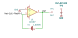

# buffer_variation

SBOA092B page 52, *Buffer Variation*: the cell Eref in the feedback path,
between the output and the inverting input, with the non-inverting input on
ground. The op amp is a TLC265x, a chopper-stabilized part.

```
E_O = Eref
```

## The circuit



The schematic is drawn by [copperhead](https://github.com/copperheadhq/copperhead)'s
drafting engine from this circuit's netlist, with KiCad's own library symbols,
and it opens in KiCad as [`figure/buffer_variation.kicad_sch`](figure/buffer_variation.kicad_sch).
The op amp is KiCad's generic one, since the handbook's are ideal, and each
terminal is a test point named as the program names it. KiCad reads back from
the sheet exactly the connections the circuit has; `draw_figures.py` refuses to write
one that does not.


The interconnect view is fang's own projection. It names the parts as the
program does, so it reads against the code below.

## What the program says

The loop holds the inverting input at ground, so the output stands one cell
voltage above it, and the cell only carries what that input draws. Two things
are open and recorded as choices: `cell`, a Weston cell at 1.0183 V with its
+ terminal on the output (the output terminal is labelled Eref, not -Eref),
and `amp_model`, a 1 µV offset, what a TLC2652A is specified to. Whatever
offset the op amp has lands on E_O undivided, which is why the figure names a
chopper.

## What the simulation found

[`out/simulation.txt`](out/simulation.txt):

| Run | Measured | Claimed |
| --- | ---: | ---: |
| `chopper`, E_O | 1.0183 V | 1.0183 V (`e_out`) ± 10 ppm, holds |
| `chopper`, cell current | 1e-18 A | 0 (`i_cell`) ± 1 nA, holds |
| `general_part`, E_O - Eref with a 5 mV offset | -5.001 mV | -5 mV, holds |

The second run is not a handbook claim. It gives the same circuit a
general-purpose part's 5 mV offset, and the output is off by all of it, 0.5%
of Eref. The chopper's 1 µV is 1 ppm.

## Running it

```bash
fang check examples/ti_opamp_handbook/references/buffer_variation/buffer_variation.py
python examples/regenerate.py ti_opamp_handbook/references/buffer_variation   # needs ngspice
```
