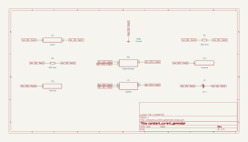

# constant_current_generator

SBOA092B page 51, *Constant Current Generator*: R_1 (330 Ω) from +15 V to a
6 V zener, R_2 (300 Ω) from the zener to the op amp's summing point, and the
load R_L from there to the output.

```
I = V_Z / R_2 = 6 / 300 = 20 mA
R_1 = (15 - V_Z) / I_Z = 9 / 25 = 360 Ω
R_L min = Saturation Voltage / I = 13.5 V / 20 mA = 675 Ω
```

## The circuit



The schematic is compiled from the program and drawn by KiCad, and it opens in
KiCad as [`out/constant_current_generator.kicad_sch`](out/constant_current_generator.kicad_sch). A part with a symbol
of its own is drawn with it; the op amp and the handbook's other parts are
boxes carrying their own pins, and each net is a label rather than a wire.


The interconnect view is fang's own projection. It names the parts as the
program does, so it reads against the code below.

## What the program says

The loop holds the summing point at ground, so R_2 carries V_Z / R_2 into it
and all of that leaves through R_L to the output. The parameters: `i_out`
(20 mA, tied to the zener's 6 V and R_2), `i_zener` (what the zener keeps,
(15 - V_Z) / R_1 - I = 7.27 mA), and `r_load_max` (13.5 V / I = 675 Ω), with
R_L required to be at most that.

Recorded choices: `reading` (which op amp input the R_2 / R_L node goes to),
`bias` (R_1 is the drawn 330 Ω, not the printed 360 Ω) and `load` (R_L is a
rheostat at 500 Ω, turned to 800 Ω for one run).

## What the simulation found

[`out/simulation.txt`](out/simulation.txt):

| Run | Measured | Claimed |
| --- | ---: | ---: |
| `inside_limit`, I x R_2 / V_Z (measured) | 1 | 1 ± 0.01%, holds |
| `inside_limit`, I | 20.09 mA | 20 mA (`i_out`) ± 1%, holds |
| `inside_limit`, zener current | 7.096 mA | 7.273 mA (`i_zener`) ± 5%, holds |
| `inside_limit`, V_Z | 6.028 V | not a claim |
| `past_limit` (R_L = 800 Ω), E_O | -13.51 V | -13.5 V, holds |
| `past_limit`, I / ((V_Z + 13.5 V) / (R_2 + R_L)) | 1 | 1 ± 0.1%, holds |

I is exactly V_Z / R_2 against the zener voltage the run measured. It is 0.5%
above the nominal 20 mA because the zener model sits at 6.028 V at 7 mA, which
is why that claim is held to 1%; a real 6 V zener is a 5% part.

## Where the handbook is off

- **The op amp's inputs are swapped in the drawing.** As drawn, the R_2 / R_L
  node goes to the + input and the - input to ground, so R_L feeds the output
  back positively. A transient of that wiring, run by hand, latches at
  +13.5 V. The program wires it the other way, the circuit the formulas
  describe, and records the reading.
- **R_1's formula leaves out I.** R_2's 20 mA comes out of the zener node, so
  R_1 carries I_Z + I, not I_Z. For I_Z = 25 mA it would be 9 / 45 = 200 Ω.
  The printed 360 Ω would leave the zener 5 mA; the drawn 330 Ω leaves it
  7.3 mA (7.1 mA measured). 330 Ω is not a rounding of 360 Ω either; the
  program keeps the drawn value.
- **"R_L min" is a maximum.** The output sits at -I R_L, so 675 Ω is the
  largest load it can drive 20 mA through. At 800 Ω the output pins at
  -13.5 V, the summing point leaves ground, and I falls to
  (V_Z + 13.5 V) / (R_2 + R_L) = 17.8 mA.

## Running it

```bash
fang check examples/ti_opamp_handbook/references/constant_current_generator/constant_current_generator.py
python examples/regenerate.py ti_opamp_handbook/references/constant_current_generator   # needs ngspice and kicad-cli
```
