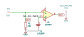
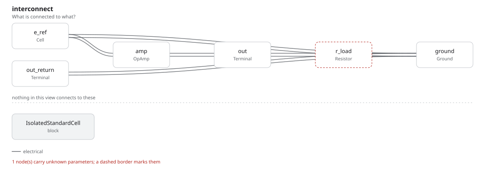

# isolated_standard_cell

SBOA092B page 51, *Isolated Standard Cell*: a standard cell Eref on the
non-inverting input of a follower. The text's point is that a low-impedance
meter (it names 20 kΩ per volt) can then read the cell without drawing
current from it.

```
E_O = Eref, and the cell supplies no current
```

## The circuit



The schematic is drawn by [copperhead](https://github.com/copperheadhq/copperhead)'s
drafting engine from this circuit's netlist, with KiCad's own library symbols,
and it opens in KiCad as [`figure/isolated_standard_cell.kicad_sch`](figure/isolated_standard_cell.kicad_sch).
The op amp is KiCad's generic one, since the handbook's are ideal, and each
terminal is a test point named as the program names it. KiCad reads back from
the sheet exactly the connections the circuit has; `draw_figures.py` refuses to write
one that does not.



The interconnect view is fang's own projection. It names the parts as the
program does, so it reads against the code below.

## What the program says

The figure gives the cell no value and draws no meter, so the program
records two choices: `cell`, a saturated Weston cell at 1.0183 V, and `load`,
20 kΩ on the output (a 20 kΩ/V meter on its 1 V range). The parameters are
the output (`e_out = Eref`), the meter's current (`i_load = Eref / 20 kΩ`,
50.915 µA) and the cell's current (`i_cell = 0`).

## What the simulation found

[`out/simulation.txt`](out/simulation.txt):

| Run | Measured | Claimed |
| --- | ---: | ---: |
| `loaded`, E_O | 1.0183 V | 1.0183 V (`e_out`), holds |
| `loaded`, meter current | 50.91 µA | 50.92 µA (`i_load`), holds |
| `loaded`, cell current | 1e-18 A | 0 (`i_cell`) ± 1 nA, holds |

The meter's 51 µA comes from the op amp's output. Without the follower it
would come from the cell. The model's inputs are 1 TΩ apart and draw no bias
current, which is why the cell's current is 10^-18 A; a real FET-input part
draws picoamps, which is why the claim is held to 1 nA.

## Running it

```bash
fang check examples/ti_opamp_handbook/references/isolated_standard_cell/isolated_standard_cell.py
python examples/regenerate.py ti_opamp_handbook/references/isolated_standard_cell   # needs ngspice
```
