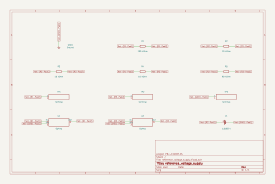
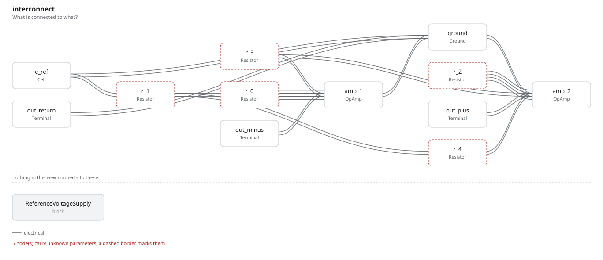

# reference_voltage_supply

SBOA092B page 52, *Reference Voltage Supply*: the cell Eref through R_1
(10 kΩ) into an inverter with R_0 (100 kΩ) across it, whose output is -E_O;
R_3 and R_2 (10 kΩ each) make a second, unity-gain inverter whose output is
+E_O; and R_4 (90 kΩ) runs from +E_O back to the cell's + terminal.

The handbook prints no formula. The drawing's:

```
-E_O = -(R_0 / R_1) Eref = -10 Eref,   +E_O = +10 Eref
```

## The circuit



The schematic is compiled from the program and drawn by KiCad, and it opens in
KiCad as [`out/reference_voltage_supply.kicad_sch`](out/reference_voltage_supply.kicad_sch). A part with a symbol
of its own is drawn with it; the op amp and the handbook's other parts are
boxes carrying their own pins, and each net is a label rather than a wire.



The interconnect view is fang's own projection. It names the parts as the
program does, so it reads against the code below.

## What the program says

R_4 is the point of the figure. It carries (10 Eref - Eref) / 90 kΩ =
Eref / 10 kΩ into the cell's node, exactly the current R_1 draws out of it, so
the cell supplies no net current. The program holds that as a constraint on
`i_cell`, with the arithmetic in `bootstrap`. The cell has no value in the
figure, so `cell` records a Weston cell, 1.0183 V, for ±10.183 V out.

## What the simulation found

[`out/simulation.txt`](out/simulation.txt):

| Run | Measured | Claimed |
| --- | ---: | ---: |
| `outputs`, -E_O | -10.183 V | -10.183 V (`e_out_minus`), holds |
| `outputs`, +E_O | 10.183 V | 10.183 V (`e_out_plus`), holds |
| `outputs`, cell current | 453.5 pA | 0 (`i_cell`) ± 1 nA, holds |
| `outputs`, current in R_1 | 101.8 µA | not a claim |

The cell's current is not zero in the simulation because the outputs carry
the op amps' ppm-level loop-gain error, and R_4's current with them. It is
453 pA against the 101.8 µA R_1 draws, a cancellation to 4.5 ppm.

## Running it

```bash
fang check examples/ti_opamp_handbook/references/reference_voltage_supply/reference_voltage_supply.py
python examples/regenerate.py ti_opamp_handbook/references/reference_voltage_supply   # needs ngspice and kicad-cli
```
