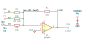

# adder

SBOA092B page 64, *Adder*: E1, E2 and E3 each through 10 kΩ into the summing
point, 10 kΩ from the output back to it, and the non-inverting input on
ground.

```
E_O = -(E1 + E2 + E3)
Z_in = 10 kΩ for each input
```

## The circuit



The schematic is drawn by [copperhead](https://github.com/copperheadhq/copperhead)'s
drafting engine from this circuit's netlist, with KiCad's own library symbols,
and it opens in KiCad as [`figure/adder.kicad_sch`](figure/adder.kicad_sch).
The op amp is KiCad's generic one, since the handbook's are ideal, and each
terminal is a test point named as the program names it. KiCad reads back from
the sheet exactly the connections the circuit has; `draw_figures.py` refuses to write
one that does not.


The interconnect view is fang's own projection. It names the parts as the
program does, so it reads against the code below.

## What the program says

Each input is an inverting amplifier of gain `a_v = -1`, and because the
summing point is a virtual ground each source sees only its own resistor,
`z_in = 10 kΩ`. Both hold for every input:

```python
for r_n in (self.r_1, self.r_2, self.r_3):
    require(equals(self.a_v, negative(over(r_o, r_n.resistance))))
    require(equals(self.z_in, r_n.resistance))
```

The figure gives every value, so nothing was chosen.

## What the simulation found

[`out/simulation.txt`](out/simulation.txt), from the deck under
[`out/spice/`](out/spice/). One run drives E1..E3 with 1, 2 and -0.5 V:

| Measured in `sum` | Measured | Claimed |
| --- | ---: | ---: |
| E_O | -2.5 V | -2.5 V, holds |
| E_O / (E1 + E2 + E3) | -1 | -1 (`a_v`), holds |
| E1 / I1 | 10 kΩ | 10 kΩ (`z_in`), holds |
| E2 / I2 | 10 kΩ | 10 kΩ (`z_in`), holds |
| E3 / I3 | 10 kΩ | 10 kΩ (`z_in`), holds |

The impedances hold with all three inputs driven at once, which is what "the
inputs are effectively isolated from each other" means.

## Running it

```bash
fang check examples/ti_opamp_handbook/summers/adder/adder.py
python examples/regenerate.py ti_opamp_handbook/summers/adder   # needs ngspice
```
