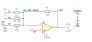

# averager

SBOA092B page 65, *Averager*: E1, E2 and E3 each through 30 kΩ into the
summing point, 10 kΩ from the output back to it.

```
E_O = -(R_O/R_I)(E1 + E2 + E3) = -(E1 + E2 + E3)/3
R_O = R_I divided by number of inputs
```

## The circuit



The schematic is drawn by [copperhead](https://github.com/copperheadhq/copperhead)'s
drafting engine from this circuit's netlist, with KiCad's own library symbols,
and it opens in KiCad as [`figure/averager.kicad_sch`](figure/averager.kicad_sch).
The op amp is KiCad's generic one, since the handbook's are ideal, and each
terminal is a test point named as the program names it. KiCad reads back from
the sheet exactly the connections the circuit has; `draw_figures.py` refuses to write
one that does not.


The interconnect view is fang's own projection. It names the parts as the
program does, so it reads against the code below.

## What the program says

The page's rule is the constraint, with the count of inputs as a parameter,
`inputs = 3`, written without the division so it is exact:

```python
require(equals(product(self.inputs, self.r_out.resistance), r_i.resistance))
```

The bench measures that count back as the divisor, -(E1 + E2 + E3)/E_O. The
figure gives every value, so nothing was chosen.

## What the simulation found

[`out/simulation.txt`](out/simulation.txt), from the decks under
[`out/spice/`](out/spice/):

| Run | Measured | Claimed |
| --- | ---: | ---: |
| `average`, E1..E3 = 1, 2, 4.5 V: E_O | -2.5 V | -2.5 V, holds |
| `average`: the divisor | 3 | 3 (`inputs`), holds |
| `unused_input_grounded`, E3 = 0 V: E_O | -1 V | -1 V, holds |
| `unused_input_open`, E3 left open: E_O | -1 V | -1 V, holds |

The page's next line says to ground unused inputs to preserve scale. In this
inverting circuit an open input gives the same E_O as a grounded one: the
open resistor sits at the summing point's ground and carries nothing, so the
unused input counts as zero either way and the divisor stays 3. What
grounding does change is the noise gain (2 with all three resistors to
ground, 1.67 with one open), which sets the output offset and bandwidth, not
the scale.

## Running it

```bash
fang check examples/ti_opamp_handbook/summers/averager/averager.py
python examples/regenerate.py ti_opamp_handbook/summers/averager   # needs ngspice
```
