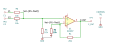
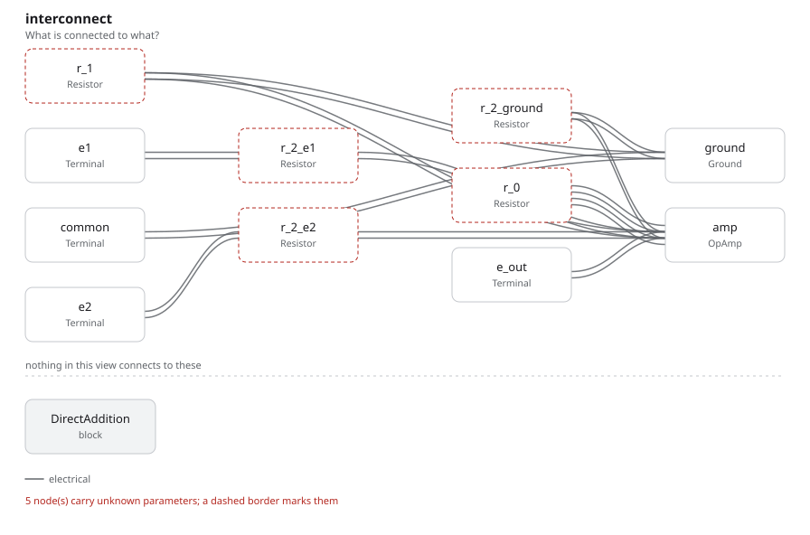

# direct_addition

SBOA092B page 65, *Direct Addition*: E1 and E2 each through a 10 kΩ R2 onto
the non-inverting input, a third 10 kΩ R2 from there to ground, and a
non-inverting gain set by 10 kΩ R1 from the inverting input to ground and
20 kΩ R0 back from the output.

```
E_O = E1 + E2
Z_in = (3/2) R2 = 15 kΩ for each input
R_O = 2 R_I
```

## The circuit



The schematic is drawn by [copperhead](https://github.com/copperheadhq/copperhead)'s
drafting engine from this circuit's netlist, with KiCad's own library symbols,
and it opens in KiCad as [`figure/direct_addition.kicad_sch`](figure/direct_addition.kicad_sch).
The op amp is KiCad's generic one, since the handbook's are ideal, and each
terminal is a test point named as the program names it. KiCad reads back from
the sheet exactly the connections the circuit has; `draw_figures.py` refuses to write
one that does not.



The interconnect view is fang's own projection. It names the parts as the
program does, so it reads against the code below.

## What the program says

The + input sits at (E1 + E2)/3, the average of E1, E2 and ground. The page's
rule R0 = 2 R1 makes `noise_gain = 1 + R0/R1 = 3`, which undoes the third, so
each input's weight is `a_v = 1`. The program writes the weight from the
resistors, and the input impedance with it:

```python
require(equals(self.a_v, over(product(below, self.noise_gain), total(own, below))))
require(equals(self.z_in, total(own, below)))
```

where `below` is the other two R2 in parallel. The figure gives every value,
so nothing was chosen.

## What the simulation found

[`out/simulation.txt`](out/simulation.txt), from the decks under
[`out/spice/`](out/spice/):

| Run | Measured | Claimed |
| --- | ---: | ---: |
| `e1_alone`, E1 = 1 V, E2 grounded: gain, Z_in | 1, 15 kΩ | 1 (`a_v`), 15 kΩ (`z_in`), both hold |
| `e2_alone`, E2 = 1 V, E1 grounded: gain, Z_in | 1, 15 kΩ | 1 (`a_v`), 15 kΩ (`z_in`), both hold |
| `both`, E1 = 1.5 V, E2 = -0.5 V: E_O | 1 V | 1 V, holds |
| `both`: the + input | 333.3 mV | (E1 + E2)/3, holds |
| `both`: E1 / I1 | 12.86 kΩ | not a claim |

The + input is not a virtual ground, so unlike the inverting adder the inputs
load each other: the page's 15 kΩ holds with the other input grounded, and
with both driven E1's source sees 12.86 kΩ here.

## Running it

```bash
fang check examples/ti_opamp_handbook/summers/direct_addition/direct_addition.py
python examples/regenerate.py ti_opamp_handbook/summers/direct_addition   # needs ngspice
```
