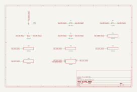

# scaling_adder

SBOA092B page 64, *Scaling Adder*: E1, E2 and E3 through 1, 10 and 100 kΩ into
the summing point, 100 kΩ R0 back from the output.

```
E_O = -(R0/R1 E1 + R0/R2 E2 + R0/R3 E3) = -(100 E1 + 10 E2 + E3)
Z_in = 1 kΩ for E1, 10 kΩ for E2, 100 kΩ for E3
```

## The circuit



The schematic is compiled from the program and drawn by KiCad, and it opens in
KiCad as [`out/scaling_adder.kicad_sch`](out/scaling_adder.kicad_sch). A part with a symbol
of its own is drawn with it; the op amp and the handbook's other parts are
boxes carrying their own pins, and each net is a label rather than a wire.


The interconnect view is fang's own projection. It names the parts as the
program does, so it reads against the code below.

## What the program says

Each weight is a parameter held to the parts, `a_1 = -R0/R1 = -100`,
`a_2 = -10`, `a_3 = -1`, and each input impedance is its own resistor,
`z_1`..`z_3`. The figure gives every value, so nothing was chosen.

## Where the handbook is off

The page prints E_O = -100(100 E1 + 10 E2 + E3). The leading 100 is not in the
figure: R0/R1 is 100, so E1's weight is -100, not -10 000. The program holds
the weights the resistors give, `figure` quotes the printed line, and the
simulation agrees with the resistors.

## What the simulation found

[`out/simulation.txt`](out/simulation.txt), from the decks under
[`out/spice/`](out/spice/):

| Run | Measured | Claimed |
| --- | ---: | ---: |
| `e1_alone`, E1 = 0.1 V: gain, Z_in | -99.99, 1 kΩ | -100 (`a_1`), 1 kΩ (`z_1`), both hold |
| `e2_alone`, E2 = 0.1 V: gain, Z_in | -9.999, 10 kΩ | -10 (`a_2`), 10 kΩ (`z_2`), both hold |
| `e3_alone`, E3 = 0.1 V: gain, Z_in | -0.9999, 100 kΩ | -1 (`a_3`), 100 kΩ (`z_3`), both hold |
| `all_three`, E1..E3 = 0.01, 0.1, 1 V: E_O | -3 V | -3 V, holds |

The printed formula would ask for -300 V from the last run. The gains land
10^-4 short of the ideal because the noise gain here is 1 + R0/(R1 ∥ R2 ∥ R3) =
112, against 10^6 of open-loop gain.

## Running it

```bash
fang check examples/ti_opamp_handbook/summers/scaling_adder/scaling_adder.py
python examples/regenerate.py ti_opamp_handbook/summers/scaling_adder   # needs ngspice and kicad-cli
```
