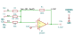

# voltage_summer

SBOA092B page 63, *The Voltage Summer*: E1, E2 and E3 each through its own
resistor into the summing point, R_O from the output back to it, and the
non-inverting input on ground.

```
E_O = -R_O (E1/R1 + E2/R2 + E3/R3)
```

## The circuit



The schematic is drawn by [copperhead](https://github.com/copperheadhq/copperhead)'s
drafting engine from this circuit's netlist, with KiCad's own library symbols,
and it opens in KiCad as [`figure/voltage_summer.kicad_sch`](figure/voltage_summer.kicad_sch).
The op amp is KiCad's generic one, since the handbook's are ideal, and each
terminal is a test point named as the program names it. KiCad reads back from
the sheet exactly the connections the circuit has; `draw_figures.py` refuses to write
one that does not.


The interconnect view is fang's own projection. It names the parts as the
program does, so it reads against the code below.

## What the program says

The figure names the resistors and gives them no values, so the program
chooses them and records the choice as a decision (`values`): R_O = 100 kΩ and
R1, R2, R3 = 10, 20 and 50 kΩ, so the three weights, -10, -5 and -2, all
differ and an input wired to the wrong resistor would show. Each weight is a
parameter held to the parts:

```python
require(equals(self.a_1, negative(over(r_o, self.r_1.resistance))))
```

The page draws a dotted line for "any number" of inputs; the program builds
the three drawn.

## What the simulation found

[`out/simulation.txt`](out/simulation.txt), from the decks under
[`out/spice/`](out/spice/):

| Run | Measured | Claimed |
| --- | ---: | ---: |
| `e1_alone`, E1 = 1 V | -10 | -10 (`a_1`), holds |
| `e2_alone`, E2 = 1 V | -5 | -5 (`a_2`), holds |
| `e3_alone`, E3 = 1 V | -2 | -2 (`a_3`), holds |
| `all_three`, E1..E3 = 0.5, 0.3, -0.4 V: E_O | -5.7 V | -5.7 V, holds |
| `all_three`: the summing point | 5.7 µV | 0 ± 10 µV, holds |
| `all_three`: I_O through R_O | 57 µA | 57 µA, holds |
| `all_three`: I1 + I2 + I3 | 57 µA | 57 µA, holds |

The last three are the page's two "summing point restraints": the summing
point sits at ground (to within E_O over the open-loop gain), and the current
into it through R_O balances the currents in.

## Running it

```bash
fang check examples/ti_opamp_handbook/summers/voltage_summer/voltage_summer.py
python examples/regenerate.py ti_opamp_handbook/summers/voltage_summer   # needs ngspice
```
