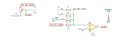

# weighted_average

SBOA092B page 66, *Weighted Average*: E1, E2 and E3 through 10, 20 and 30 kΩ
into the summing point, and back from the output 5.1 kΩ R_O in series with a
1 kΩ pot R_O' wired as a rheostat.

```
E_O = -(R_O + R_O')(E1/R1 + E2/R2 + E3/R3)
R_O + R_O' = R1 ∥ R2 ∥ R3
```

## The circuit



The schematic is drawn by [copperhead](https://github.com/copperheadhq/copperhead)'s
drafting engine from this circuit's netlist, with KiCad's own library symbols,
and it opens in KiCad as [`figure/weighted_average.kicad_sch`](figure/weighted_average.kicad_sch).
The op amp is KiCad's generic one, since the handbook's are ideal, and each
terminal is a test point named as the program names it. KiCad reads back from
the sheet exactly the connections the circuit has; `draw.py` refuses to write
one that does not.


The interconnect view is fang's own projection. It names the parts as the
program does, so it reads against the code below.

## What the program says

The page's rule sets the pot: with equal inputs E_O should be as large as
E_I, so the three weights must add to 1, and they do when the feedback equals
R1 ∥ R2 ∥ R3 = 5.4545 kΩ. The pot then supplies 354.5 Ω, 0.3545 of its travel.
The figure draws the pot and leaves the setting to the rule, so the program
records it as a decision (`setting`) and holds it to the rule:

```python
require(within(feedback, parallel(parallel(inputs[0], inputs[1]), inputs[2]), 0.00001))
```

The weights `a_1`..`a_3` are the feedback over each input resistor, and
`a_equal` is their sum.

## Where the handbook is off

- The page prints E_O = -(16.4 E1 + 8.2 E2 + 5.4 E3)/30. The exact numerators
  are 16.36, 8.18 and 5.45. The first two are rounded; the third is cut short
  (5.45 rounds to 5.5), and the printed three add to 30 only because of it.
- It asks that R_O' be set "so E_O = E_I". The circuit inverts, as the page's
  own formula says, so the rule gives E_O = -E_I.

## What the simulation found

[`out/simulation.txt`](out/simulation.txt), from the decks under
[`out/spice/`](out/spice/):

| Run | Measured | Claimed |
| --- | ---: | ---: |
| `e1_alone`, E1 = 1 V | -0.5455 | -0.5455 (`a_1`), holds; printed 16.4/30 = 0.5467 |
| `e2_alone`, E2 = 1 V | -0.2727 | -0.2727 (`a_2`), holds; printed 8.2/30 = 0.2733 |
| `e3_alone`, E3 = 1 V | -0.1818 | -0.1818 (`a_3`), holds; printed 5.4/30 = 0.18 |
| `equal_inputs`, all three 1 V | -1 | -1 (`a_equal`), holds |
| `weighted`, E1..E3 = 3, -1.5, 1.2 V: E_O | -1.445 V | -1.446 V, holds |

## Running it

```bash
fang check examples/ti_opamp_handbook/summers/weighted_average/weighted_average.py
python examples/regenerate.py ti_opamp_handbook/summers/weighted_average   # needs ngspice
```
