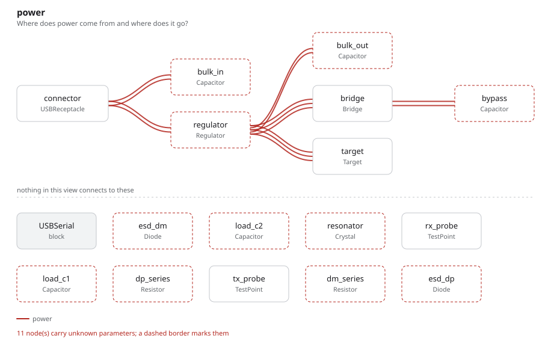
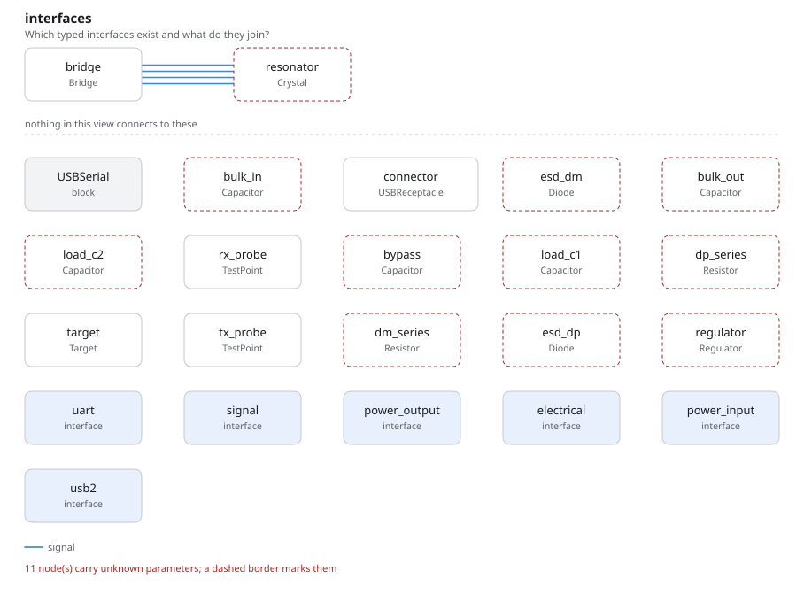

# usb_uart_bridge

USB to serial: the interface board on nearly every desk. What it adds over the
other examples is **part selection** — the difference between what the design
needs and what was bought.

## The program

[`usb_uart_bridge.py`](usb_uart_bridge.py) makes the selection in `__init__`,
not in the class body:

```python
def __init__(self, **overrides):
    super().__init__(**overrides)
    self.bridge.select("WCH", "CH340C",
                       distributor_ids={"lcsc": "C84681"},
                       datasheet="SRC-DS-CH340")
```

The class body would attach the choice to the template every instance derives
from. The instance is where it belongs: the logical part stays "a 3.3 V
regulator", and which one was bought is a separate, cited fact that a second
board can answer differently.

The decision behind it is in the graph too, with what it rejected and why —
`FT232RL` on unit cost, `CP2102N` on needing an oscillator — and it names the
requirement it serves.

The UART crossing is worth reading as well:

```python
self.bridge.uart.tx >> self.target.uart.rx
self.bridge.uart.rx >> self.target.uart.tx
```

Connecting the two *ports* would pair like names with like — tx to tx — so the
two wires are named individually. That a signal of an interface is addressable
on its own is the whole reason this works.

## What comes out

17 parts, 11 nets, 162 entities, 24 checks — none failed, six undecided.

- [`out/usb_uart_bridge.net`](out/usb_uart_bridge.net) — the KiCad netlist, ESD
  clamps and series resistors included
- [`out/rationale.md`](out/rationale.md) — the requirement, the bridge decision
  with both rejected alternatives, and the USB 2.0 citation behind the D+ pull-up
- [`out/checks.txt`](out/checks.txt), [`out/graph.txt`](out/graph.txt)





## Running it

```bash
fang check   examples/usb_uart_bridge/usb_uart_bridge.py
fang netlist examples/usb_uart_bridge/usb_uart_bridge.py
```
